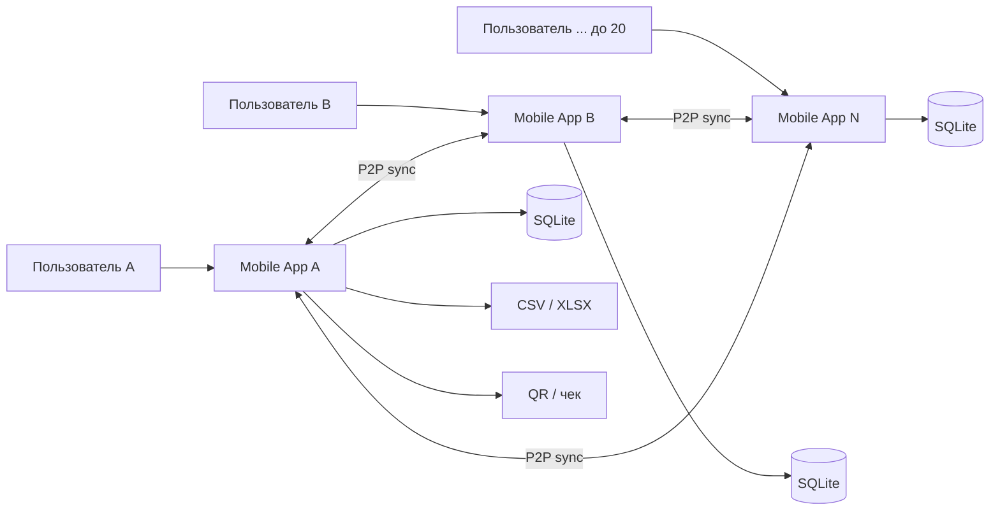
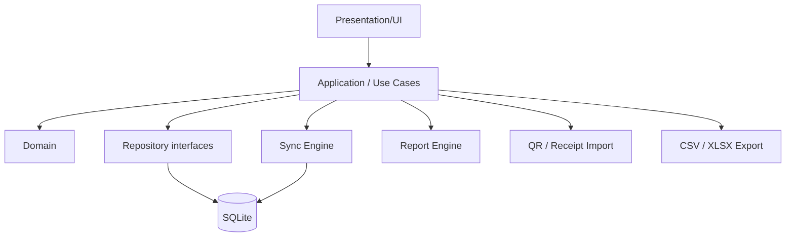

# 2. Архитектура

## 2.1. Архитектурный стиль

**Local-first + peer-to-peer replication + modular monolith inside mobile app.**

Каждое мобильное приложение содержит:

- UI;
- application/use-case layer;
- domain layer;
- локальное хранилище;
- движок отчетов;
- движок импорта/экспорта;
- QR/OCR-подсистему;
- P2P sync engine.

Рекомендуемый стек: **Flutter** для Android/iOS, **SQLite** как локальная БД. Денежные значения хранятся целым числом в минимальных единицах валюты, а не `float/double`.

## 2.2. Контекстная схема

На практике для 20 участников не рекомендуется постоянный full-mesh. Во время общей sync-сессии один из участников временно становится **координатором** и принимает соединения остальных. Это роль внутри приложения, а не постоянно развернутый сервер.

## 2.3. Внутренняя архитектура приложения

## 2.4. Модули

### Budget
Управляет бюджетом, участниками и правами.

### Transactions
CRUD транзакций. Любое изменение сначала фиксируется локально, затем попадает в журнал синхронизации.

### Planning
План по категории и месяцу.

### Reports
Строит агрегаты только по локальной БД, поэтому работает без сети.

### Receipt Import
Сканирует QR либо фото чека и формирует черновик транзакции.

### Export
Создает CSV/XLSX локально и передает файл стандартному системному Share Sheet.

### Sync
Обнаружение устройств, обмен векторами состояния и недостающими операциями, разрешение конфликтов.

## 2.5. Роли

Минимально:

- `OWNER` — управление бюджетом и участниками;
- `EDITOR` — транзакции, планы, отчеты;
- `VIEWER` — только чтение и экспорт.

## 2.6. Идентификация без backend

При первом запуске приложение генерирует локальную пару ключей пользователя/устройства. Приглашение в бюджет передается QR-кодом или файлом приглашения.

QR приглашения содержит минимум:

- `budget_id`;
- идентификатор/ключ владельца;
- одноразовый invite payload;
- параметры шифрования общего бюджета.

## 2.7. Наблюдаемость без сервера

Системные логи и диагностический пакет сохраняются локально. Пользователь может экспортировать anonymized diagnostics в файл для анализа.
