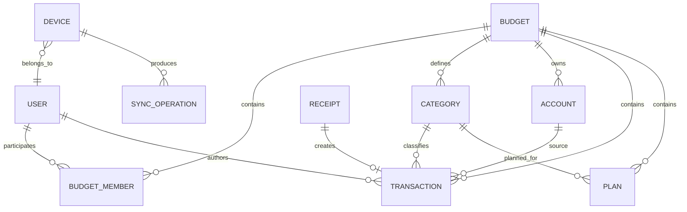

# 3. Модель данных

## 3.1. ER-модель

## 3.2. Таблицы

### `users`

| Поле | Тип | Описание |
|---|---|---|
| id | UUID | идентификатор |
| name | TEXT | имя |
| public_key | TEXT | ключ идентификации |
| created_at | TIMESTAMP | дата создания |

### `budgets`

| Поле | Тип | Описание |
|---|---|---|
| id | UUID | бюджет |
| name | TEXT | название |
| base_currency | TEXT | ISO-код валюты |
| created_by | UUID | владелец |
| created_at | TIMESTAMP | дата создания |

### `budget_members`

| Поле | Тип | Описание |
|---|---|---|
| budget_id | UUID | бюджет |
| user_id | UUID | пользователь |
| role | ENUM | OWNER/EDITOR/VIEWER |
| joined_at | TIMESTAMP | дата присоединения |
| revoked_at | TIMESTAMP? | отзыв доступа |

### `categories`

| Поле | Тип | Описание |
|---|---|---|
| id | UUID | категория |
| budget_id | UUID | бюджет |
| name | TEXT | название |
| kind | ENUM | INCOME/EXPENSE/BOTH |
| is_archived | BOOL | архив |

### `accounts`

`source` в исходной постановке лучше оформить сущностью счета/кошелька.

| Поле | Тип | Описание |
|---|---|---|
| id | UUID | счет |
| budget_id | UUID | бюджет |
| name | TEXT | Cash/Card/Bank/etc |
| opening_balance_minor | INT64 | начальный остаток |
| currency | TEXT | валюта |
| is_archived | BOOL | архив |

### `transactions`

| Поле | Тип | Описание |
|---|---|---|
| id | UUID | транзакция |
| budget_id | UUID | бюджет |
| occurred_at | TIMESTAMP | дата/время |
| amount_minor | INT64 | сумма в минимальных единицах |
| currency | TEXT | валюта |
| type | ENUM | INCOME/EXPENSE/TRANSFER |
| author_id | UUID | автор |
| account_id | UUID | источник/счет |
| destination_account_id | UUID? | для перевода |
| description | TEXT? | описание/комментарий |
| category_id | UUID? | категория |
| receipt_id | UUID? | исходный чек |
| created_at | TIMESTAMP | создано |
| updated_at | TIMESTAMP | изменено |
| deleted_at | TIMESTAMP? | soft delete |

### `plans`

Уникальность: `(budget_id, month, category_id)`.

| Поле | Тип | Описание |
|---|---|---|
| id | UUID | план |
| budget_id | UUID | бюджет |
| month | DATE | первый день месяца |
| category_id | UUID | категория |
| planned_amount_minor | INT64 | плановая сумма |
| updated_at | TIMESTAMP | изменено |

### `receipts`

| Поле | Тип | Описание |
|---|---|---|
| id | UUID | чек |
| budget_id | UUID | бюджет |
| raw_qr | TEXT? | содержимое QR |
| image_path | TEXT? | локальный путь к фото |
| merchant | TEXT? | продавец |
| receipt_time | TIMESTAMP? | дата чека |
| total_minor | INT64? | итог |
| parsed_payload | JSON | извлеченные поля |
| parse_status | ENUM | NEW/PARSED/PARTIAL/FAILED |

### `sync_operations`

| Поле | Тип | Описание |
|---|---|---|
| op_id | UUID | глобально уникальная операция |
| budget_id | UUID | бюджет |
| entity_type | TEXT | тип сущности |
| entity_id | UUID | сущность |
| op_type | ENUM | CREATE/PATCH/DELETE |
| patch | JSON | измененные поля |
| author_id | UUID | пользователь |
| device_id | UUID | устройство |
| logical_clock | INT64 | Lamport clock |
| signature | BLOB | подпись операции |
| created_at | TIMESTAMP | локальное время |

## 3.3. Индексы

Минимально:

- `transactions(budget_id, occurred_at)`;
- `transactions(budget_id, category_id, occurred_at)`;
- `transactions(budget_id, account_id, occurred_at)`;
- `plans(budget_id, month, category_id)` UNIQUE;
- `sync_operations(budget_id, logical_clock)`;
- `sync_operations(op_id)` UNIQUE.

## 3.4. Денежная арифметика

Не использовать floating point. Например `123.45 EUR` хранится как `12345` при scale=2.
