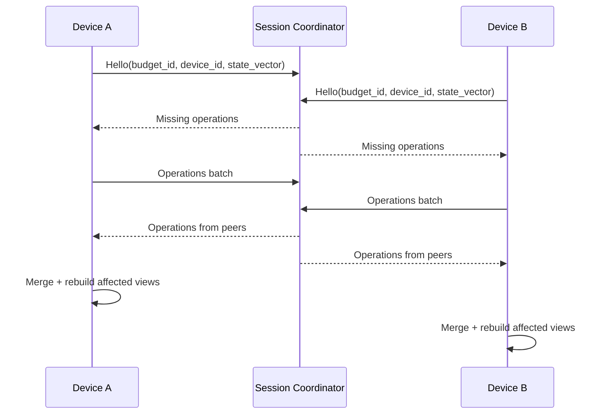

# 4. Синхронизация и конфликты

## 4.1. Цель

Обеспечить совместную работу без центрального сервера и позволить пользователю изменять данные в любой момент, даже без связи.

## 4.2. Журнал операций

Каждый локальный CREATE/UPDATE/DELETE выполняется одной SQLite-транзакцией:

1. изменяется доменная таблица;
2. добавляется `sync_operation`;
3. увеличивается локальный Lamport clock;
4. транзакция коммитится.

Так пользователь никогда не ждет сеть для сохранения данных.

## 4.3. Протокол обмена

Координатор хранит данные только как обычный участник бюджета. После завершения сессии специальный серверный процесс отсутствует.

## 4.4. Разрешение конфликтов

### Разные сущности
Конфликта нет, операции просто объединяются.

### Одновременное изменение разных полей одной сущности
Используется field-level merge.

Пример:

- пользователь A меняет `description`;
- пользователь B меняет `category_id`;
- итоговая запись содержит оба изменения.

### Одновременное изменение одного поля
Победитель определяется детерминированно по кортежу:

`(logical_clock, device_id)`.

Это LWW-register на уровне поля. Один и тот же набор операций всегда приводит все устройства к одинаковому состоянию.

### DELETE против UPDATE
`DELETE` имеет приоритет, если его версия не старше update. Удаление реализуется tombstone/soft delete, чтобы удаленная запись не воскресла после синхронизации со старым устройством.

## 4.5. Идемпотентность

`op_id` уникален. Повторная доставка одной операции безопасна и игнорируется.

## 4.6. Топология для 20 пользователей

Полный mesh на 20 устройствах дает до 190 пар соединений, поэтому основной режим:

- один временный coordinator;
- остальные подключаются к нему;
- coordinator пересылает операции;
- при потере coordinator выбирается другой участник;
- данные не зависят от coordinator, потому что каждый участник хранит собственную копию.

## 4.7. Discovery

Для устройств в одной локальной сети:

- mDNS/Bonjour или аналог локального service discovery;
- ручное подключение по QR как fallback;
- соединение защищается ключом бюджета/сессии.

## 4.8. Новое устройство

Первичная синхронизация передает snapshot бюджета + хвост журнала операций. После подтверждения snapshot старые операции можно компактизировать.

## 4.9. Backup

Пользователь может экспортировать зашифрованный backup-файл бюджета и восстановить его на новом устройстве. Backup — отдельная функция от CSV/XLSX отчетов.
