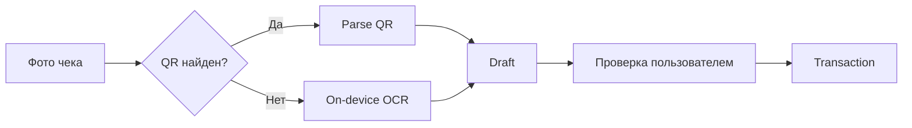

# 5. Отчеты, экспорт и фискальные документы

## 5.1. Отчет за месяц

Показывает:

- доход за месяц;
- расход за месяц;
- итоговый cash flow;
- расход по категориям;
- план / факт / остаток по категории;
- остаток по каждому счету;
- вклад каждого автора при необходимости аудита.

Формула остатка плана категории:

`remaining = planned_expense - actual_expense`

## 5.2. Отчет за год

Группировка по месяцам и категориям:

- доходы;
- расходы;
- net cash flow;
- план;
- факт;
- отклонение.

## 5.3. Произвольный период

Параметры:

- `date_from`;
- `date_to`;
- optional `category_ids`;
- optional `account_ids`;
- optional `author_ids`.

Отчет строится полностью локально SQL-агрегациями.

## 5.4. Расчет остатка счета

Для счета без переводов:

`balance = opening_balance + income - expense`

При поддержке переводов:

`balance = opening_balance + income + incoming_transfers - expense - outgoing_transfers`

## 5.5. CSV

Рекомендуемые колонки экспорта транзакций:

```text
transaction_id,date,type,amount,currency,author,account,category,description
```

Числовой формат должен быть машинно-однозначным; локализованное отображение выполняется только в UI.

## 5.6. XLSX

Минимально три листа:

1. `Summary` — итоги;
2. `By Category` — план/факт;
3. `Transactions` — детализация.

## 5.7. Создание транзакции из QR

Поток:


Если QR содержит дату и сумму, они подставляются автоматически. Продавец/назначение может попасть в описание.

## 5.8. Создание транзакции из фото чека

Поток:



Предпочтение отдается локальному распознаванию, чтобы базовый сценарий не зависел от backend.

## 5.9. Ограничение фискального импорта

Некоторые фискальные QR-коды содержат только реквизиты для поиска документа, а полная детализация доступна через внешний сервис. В архитектуре это оформляется как **опциональный client-to-provider adapter**: мобильное приложение обращается к провайдеру напрямую, когда есть интернет. Собственный сервер системы для этого не требуется.

При отсутствии интернета приложение все равно должно:

- сохранить исходный QR/фото;
- извлечь доступные локально дату/сумму;
- создать черновик;
- завершить enrich позже либо дать пользователю заполнить поля вручную.
