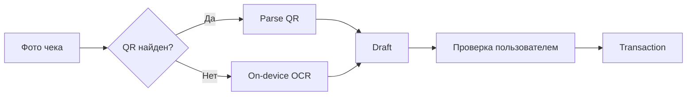

# 5. Отчеты, экспорт и фискальные документы

## 5.1. Отчет за месяц

Показывает:

- доход за месяц;
- расход за месяц;
- итоговый cash flow;
- расход по категориям;
- план / факт / остаток по категории;
- остаток по каждому счету;
- вклад каждого автора при необходимости аудита.

Формула остатка плана категории:

`remaining = planned_expense - actual_expense`

Месячный отчет строится реактивно одним локальным SQL-потоком по периоду
`[month_start, next_month_start)`. Soft-deleted операции исключаются, а переводы
не входят в income/expense/cash flow.

План хранится без отдельного currency-поля и интерпретируется в
`budgets.base_currency`. Поэтому:

- income/expense/cash flow сохраняются раздельно по валютам;
- факт категории также хранится раздельно по валютам;
- `remaining` сравнивает план только с фактом в базовой валюте бюджета;
- автоматическая FX-конвертация не выполняется.

Это не позволяет случайно сложить, например, EUR и USD в одно число.

Остатки счетов в выбранном месяце рассчитываются на конец периода:
учитываются операции с `occurred_at < next_month_start`, включая переводы.
Архивные счета остаются видимыми в историческом отчете.

Категория попадает в отчет, если для нее есть план или фактический расход.
Поддерживаются оба крайних случая: план без факта и факт без плана.
Расход без категории отображается как «Без категории».

Вклад авторов не выводится в S3: текущий этап однопользовательский. Поле
`author_id` уже сохраняется в транзакциях и может быть добавлено отдельной
группировкой на этапе совместного бюджета без изменения исходных данных.

## 5.2. Отчет за год

Группировка по месяцам и категориям:

- доходы;
- расходы;
- net cash flow;
- план;
- факт;
- отклонение.

## 5.3. Произвольный период

Параметры:

- `date_from`;
- `date_to`;
- optional `category_ids`;
- optional `account_ids`;
- optional `author_ids`.

Отчет строится полностью локально SQL-агрегациями.

## 5.4. Расчет остатка счета

Для счета без переводов:

`balance = opening_balance + income - expense`

При поддержке переводов:

`balance = opening_balance + income + incoming_transfers - expense - outgoing_transfers`

## 5.5. CSV

Рекомендуемые колонки экспорта транзакций:

```text
transaction_id,date,type,amount,currency,author,account,category,description
```

Числовой формат должен быть машинно-однозначным; локализованное отображение выполняется только в UI.

## 5.6. XLSX

Минимально три листа:

1. `Summary` — итоги;
2. `By Category` — план/факт;
3. `Transactions` — детализация.

## 5.7. Создание транзакции из QR

Поток:


```mermaid
flowchart LR
    S[Скан QR] --> P[Parse payload]
    P --> D[Черновик транзакции]
    D --> U[Пользователь проверяет категорию/счет]
    U --> T[Сохранение транзакции]
```

Если QR содержит дату и сумму, они подставляются автоматически. Продавец/назначение может попасть в описание.

## 5.8. Создание транзакции из фото чека

Поток:


```mermaid
flowchart LR
    I[Фото чека] --> Q{QR найден?}
    Q -->|Да| P[Parse QR]
    Q -->|Нет| O[On-device OCR]
    P --> D[Draft]
    O --> D
    D --> V[Проверка пользователем]
    V --> T[Transaction]
```

Предпочтение отдается локальному распознаванию, чтобы базовый сценарий не зависел от backend.

## 5.9. Ограничение фискального импорта

Некоторые фискальные QR-коды содержат только реквизиты для поиска документа, а полная детализация доступна через внешний сервис. В архитектуре это оформляется как **опциональный client-to-provider adapter**: мобильное приложение обращается к провайдеру напрямую, когда есть интернет. Собственный сервер системы для этого не требуется.

При отсутствии интернета приложение все равно должно:

- сохранить исходный QR/фото;
- извлечь доступные локально дату/сумму;
- создать черновик;
- завершить enrich позже либо дать пользователю заполнить поля вручную.
