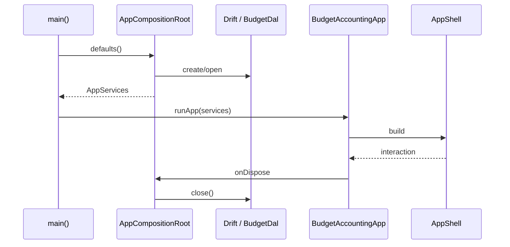
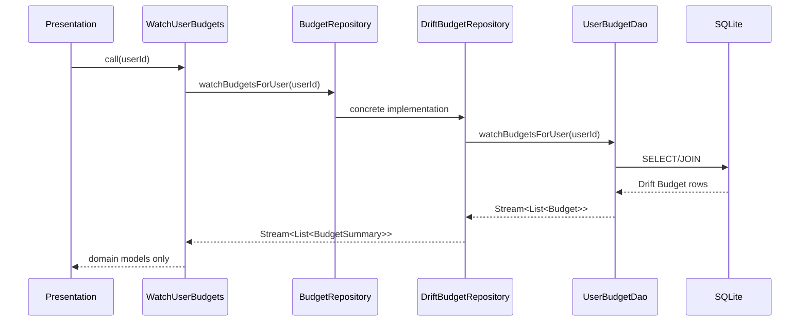

# 6. Логика приложения и границы слоев

## 6.1. Цель

Приложение строится как local-first modular monolith. Данные принадлежат локальной SQLite/Drift базе, но presentation-слой не должен знать о Drift, SQL или конкретных DAO.

Главное правило зависимостей:

```text
presentation -> application -> domain
bootstrap --------------------^
data -------------------------> domain
```

Обратные зависимости запрещены:

- `domain` не импортирует Flutter, Drift или application;
- `application` не импортирует Drift/DAO;
- `presentation` не импортирует таблицы, DAO или `BudgetDal`;
- `data` реализует интерфейсы репозиториев, объявленные в `domain`;
- `bootstrap` — единственное место, где конкретные реализации связываются между собой.

## 6.2. Слои

### Domain

Содержит бизнес-модели и абстракции, не зависящие от Flutter и БД.

Пример текущего вертикального сценария:

- `BudgetSummary` — доменная модель бюджета для списка;
- `BudgetRepository` — контракт чтения бюджетов пользователя.

Domain не знает, что данные физически хранятся в SQLite.

### Application

Содержит use cases — операции приложения, которые оркестрируют domain-контракты.

Сейчас реализован `WatchUserBudgets`:

```text
userId
  |
  v
WatchUserBudgets
  |
  v
BudgetRepository
  |
  v
Stream<List<BudgetSummary>>
```

Use case не выполняет SQL и не преобразует Drift-типы.

`AppServices` является контейнером application API, который передается в presentation.

### Data

Содержит Drift schema, DAO и адаптеры репозиториев.

`DriftBudgetRepository`:

1. получает данные через `UserBudgetDao`;
2. преобразует Drift-модель `Budget` в `BudgetSummary`;
3. возвращает только domain-модели.

Таким образом, изменение Drift schema не должно заставлять UI менять свой API.

### Presentation

Содержит Flutter widgets и локальное UI-состояние.

Для верхнеуровневой навигации используется `AppNavigationController` на базе `ChangeNotifier`.

Основные разделы:

- Операции;
- План;
- Отчеты;
- Настройки.

На текущем этапе экраны — placeholders. Реальные feature-экраны будут добавляться в следующих Issues без изменения базовых границ слоев.

### Bootstrap / composition root

`AppCompositionRoot` создается один раз при запуске приложения.

Он:

1. открывает `BudgetDal`;
2. создает concrete repository adapters;
3. создает use cases;
4. собирает `AppServices`;
5. передает application API в `BudgetAccountingApp`;
6. закрывает DAL при уничтожении корневого widget.

Concrete data implementations не создаются внутри feature widgets.

## 6.3. Поток запуска



## 6.4. Поток чтения данных

Любое чтение из UI должно проходить через application API.



## 6.5. Поток изменения данных

Для будущих mutation use cases действует такой контракт:

```text
UI event
  -> application use case
  -> domain validation
  -> repository interface
  -> data adapter
  -> DAO / transaction
  -> SQLite
```

После реализации синхронизации запись доменной сущности и `sync_operation` должны происходить в одной SQLite-транзакции. Presentation не должна создавать sync operations самостоятельно.

## 6.6. Управление состоянием

На S1 используется минимальный подход:

- constructor injection для зависимостей;
- `AppServices` для application API;
- `ChangeNotifier` только для простого локального UI-state верхней навигации;
- реактивные данные из БД остаются `Stream`-ами.

Не вводится глобальный state-management framework до появления сценария, который действительно требует его. Это уменьшает связанность и сохраняет возможность позже выбрать Riverpod/BLoC без изменений domain/application API.

## 6.7. Правила для новых функций

При добавлении feature:

1. бизнес-тип или правило помещается в `domain`;
2. пользовательская операция оформляется как use case в `application`;
3. требуемый storage-контракт объявляется интерфейсом repository в `domain`;
4. Drift-реализация помещается в `data/repositories`;
5. concrete implementation регистрируется в `AppCompositionRoot`;
6. UI получает только application/domain API;
7. минимум один unit test покрывает use case;
8. если есть DB mapping/query — добавляется data integration test;
9. пользовательский UI-сценарий покрывается widget test, когда это оправдано.

## 6.8. Тестовая стратегия

Для архитектурного каркаса используются три уровня:

- **unit** — use case с fake repository;
- **data integration** — in-memory Drift + реальный DAO + repository adapter;
- **widget** — корневой shell и навигация.

Это позволяет отдельно ловить ошибки бизнес-контракта, mapping/storage и Flutter UI.


## 6.9. Доменные правила денег и транзакций

Денежные значения моделируются через `Money` и всегда хранятся как целое число минимальных единиц валюты (`BigInt`). Для денежных вычислений domain-слой не использует `double` или `float`.

`Currency` нормализует код к верхнему регистру и принимает только трехбуквенный код. На этом уровне проверяется форма кода; наличие кода в конкретном справочнике ISO может быть добавлено отдельно, если понадобится.

Для новой транзакции действуют правила:

- сумма транзакции должна быть строго больше нуля;
- знак суммы не кодирует доход/расход — смысл задается `TransactionType`;
- валюта суммы должна совпадать с валютой исходного счета;
- INCOME и EXPENSE не имеют destination account;
- TRANSFER обязан иметь destination account;
- source и destination счета перевода должны различаться;
- на первом релизе межвалютные переводы запрещены;
- категория у TRANSFER не обязательна.

Нулевое значение `Money.zero` разрешено только для агрегатов/остатков, где ноль является валидным результатом, но не для создаваемой транзакции.

Ошибки валидации возвращаются как `DomainValidationError` с машинно-читаемым `DomainValidationCode`. UI должен отображать понятное сообщение, но не дублировать бизнес-правила.

Месяц планирования представлен `PlanningMonth`. Любая входная дата нормализуется до первого дня соответствующего месяца в 00:00, чтобы все слои использовали одинаковый ключ планирования.
